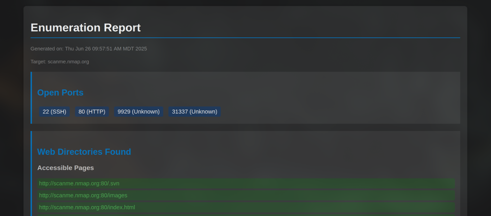

# cheatcodes
these are automation scripts for ctfs and pentesting, because im lazy

yeah so here we are.

with me doing work and you stealing it.

you lazy thief.

To use, just run:

```
export RHOST="<target>"
./stalk.sh
```

The script will prompt you to set or confirm the RHOST (target) as needed.
also this if for ctf's only, not stalking you ex. just dont. 
